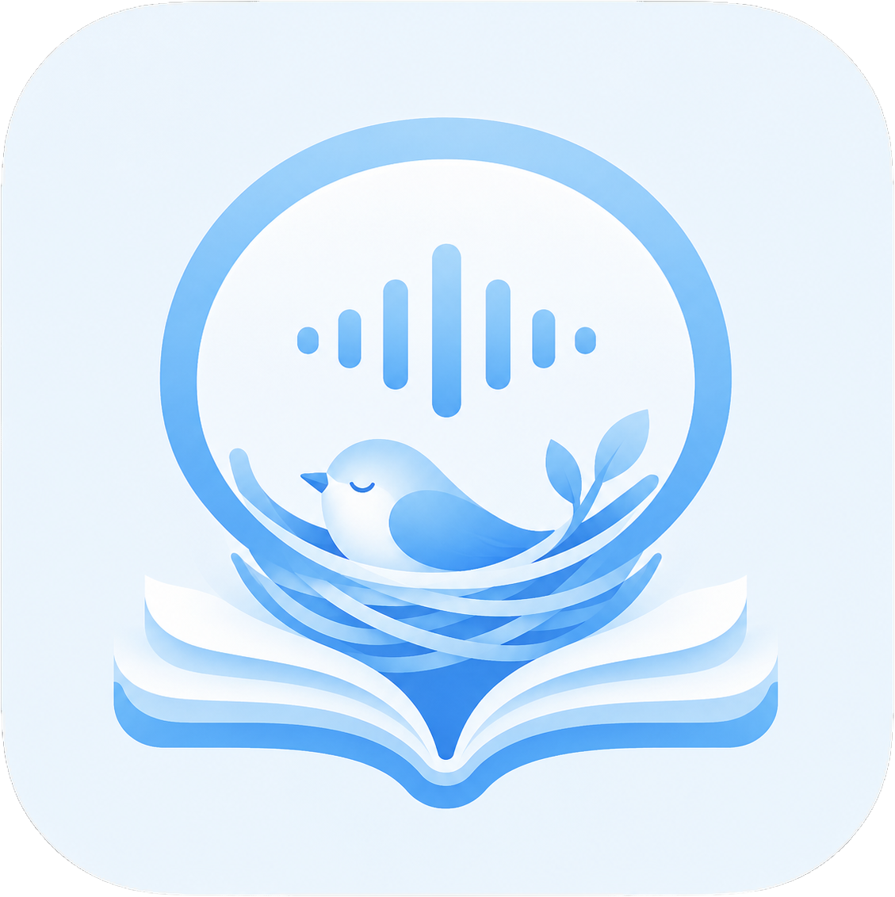

<p align="center">
  
</p>

<h1 align="center">语栖 · LearnNest</h1>

<p align="center">
  把本地视频和公开内容整理成可阅读的完整笔记，并按需生成可播放的播客音频。
</p>

LearnNest 是面向个人使用的本地学习产品。它先把字幕、画面和 OCR 整理成可追溯材料，再生成学习笔记；需要时，笔记还可以继续变成播客稿和音频。数据和运行产物默认留在用户指定的本地目录。

项目已经跑通“视频 → 完整笔记 → 播客音频”的核心路线，当前重点不再是证明 MVP，而是收敛不稳定路线、解耦 Provider 和工作流，并把 WebUI 完善为普通用户的主要入口。

## 当前能做什么

| 能力 | 当前状态 |
| --- | --- |
| 本地视频 | 支持单个文件、目录和可恢复任务处理 |
| 公开 URL | 通过本机 `yt-dlp` 尽力下载视频与平台字幕 |
| 抖音收藏 | 支持隔离官方窗口登录、默认收藏同步、待下载队列与本地缩略图 |
| 材料提取 | 支持 ASR、关键帧、OCR、evidence 和 `content_pack.json` |
| 学习笔记 | 已有严格笔记、效率笔记和质量实验链路；效率路线是后续唯一默认产品路线 |
| 播客与音频 | 已能从笔记生成播客稿、`speech.txt` 和音频 |
| WebUI | 已有本地收件箱、来源添加、任务与成品查看；统一设置与自动工作流仍在收敛 |
| 恢复与事实 | 任务/批次 JSON 保存事实，SQLite 作为可重建查询投影 |

抖音图文目前只下载为本地素材和 `image_text.json`，尚未进入视频的 ASR、关键帧、证据包和笔记流程。

## 核心流程

```text
本地视频 / 公开 URL / 抖音收藏
                │
                ▼
       字幕 · ASR · 帧 · OCR
                │
                ▼
     evidence + content_pack.json
                │
                ▼
          完整 Markdown 笔记
                │
                ├── 播客稿 / speech.txt
                └── TTS 音频
```

`content_pack.json` 和稳定 `evidence_id` 是生成阶段的共享输入合同。笔记策略、播客稿和 TTS 是不同模块；付费 Provider 阶段必须显式触发或先获得自动工作流授权。

## 当前路线说明

- **效率模式**：`assisted-note` 的 Writer + Reviewer 路线，后续作为默认笔记产品路径。
- **质量模式**：`quality-note`，仍处于开发调试阶段，成功率较低，不属于稳定承诺。
- **V4 路线**：失败率过高，已经废弃；当前代码仍有兼容实现等待移除，不应再扩展。
- **Provider 范围**：稳定 LLM 承诺将收敛到 MiMo 和 DeepSeek，同时保留新增 Provider 的模块接口。
- **TTS 边界**：后续默认使用 Windows 系统 TTS，MiMo TTS 作为可选云端方案；当前配置和编排尚未完成这项解耦。

这些是当前产品方向，不代表所有收敛工作已经在代码中完成。

## 快速开始

### 环境

- Windows
- Python 3.12
- [uv](https://docs.astral.sh/uv/)
- FFmpeg 与 FFprobe
- 真实 ASR 所需的本地模型缓存

```powershell
git clone <你的 LearnNest 仓库地址>
Set-Location .\LearnNest
uv sync
```

处理一个本地视频：

```powershell
uv run learnnest process `
  --profile evidence `
  --output-root .\learnnest-output `
  '.\lesson.mp4'
```

启动本地 WebUI：

```powershell
uv run learnnest web serve --output-root .\learnnest-output
```

然后打开 `http://127.0.0.1:8765`。服务只监听本机回环地址，不提供云端账号或局域网托管。Windows 一键启动脚本属于下一阶段工作，当前仍使用上述命令。

查看当前 CLI：

```powershell
uv run learnnest --help
uv run learnnest doctor
```

`doctor` 不应下载模型或产生付费调用；完整检查需要本机 ASR/OCR 环境以及 `src/learnnest/fixtures/README.md` 说明的本地 fixture。

## 生成阶段与付费边界

基础材料管线不需要付费 LLM。当前代码中的笔记、播客与 TTS 命令分别显式运行；`process`、`queue run` 和本地恢复不得暗中调用付费 Provider。

```powershell
uv run learnnest assisted-note --help
uv run learnnest podcast --help
uv run learnnest tts --help
```

当前版本仍保留历史配置和 Provider 兼容路径，具体可用参数以命令帮助和 [`.env.example`](.env.example) 为准。不要把计划中的 MiMo/DeepSeek 注册表、职责绑定或 Windows TTS 默认值误认为已经实现。

自动工作流必须默认关闭，并由用户显式授权。自动重试只能处理明确的临时错误，所有尝试必须可见并计数；结果为 `unknown` 时停止，不能跨 Provider 自动切换。

## 本地优先与安全

- API Key、Cookie、原始 Provider 请求、模型、媒体和运行产物不进入 Git。
- WebUI 的抖音登录态使用 Windows 当前用户 DPAPI 加密，保存在对应输出根的 `.learnnest/douyin/session.dpapi`。
- 程序不读取日常浏览器配置，不把解密 Cookie 写回 `.env`、任务、日志或 SQLite。
- 请只处理你有权访问、下载和使用的内容，并遵守目标平台规则和适用法律。

不同版本可能使用不同锁目录；切换代码版本前，先停止正在访问同一输出根的旧进程。

## 开发

主要模块边界：

```text
来源适配
  → 确定性材料管线
  → evidence / content_pack
  → 笔记策略
  → 标准笔记
  → 播客稿 / speech.txt
  → TTS
  → WebUI / CLI
```

WebUI 应调用应用服务，不直接拼接底层 CLI 或 Provider。ASR、OCR、LLM 和 TTS 按能力注册；笔记和播客按工作流职责引用 LLM Provider。

常用验证：

```powershell
uv run pytest -q
uv run ruff check src tests
uv run ruff format --check src tests
uv run learnnest --help
uv run learnnest doctor
git diff --check
```

维护代码前请阅读 [AGENTS.md](AGENTS.md)；兼容入口见 [AGENT.md](AGENT.md)。

## 许可证

许可证将在首次正式公开发布前确定。
